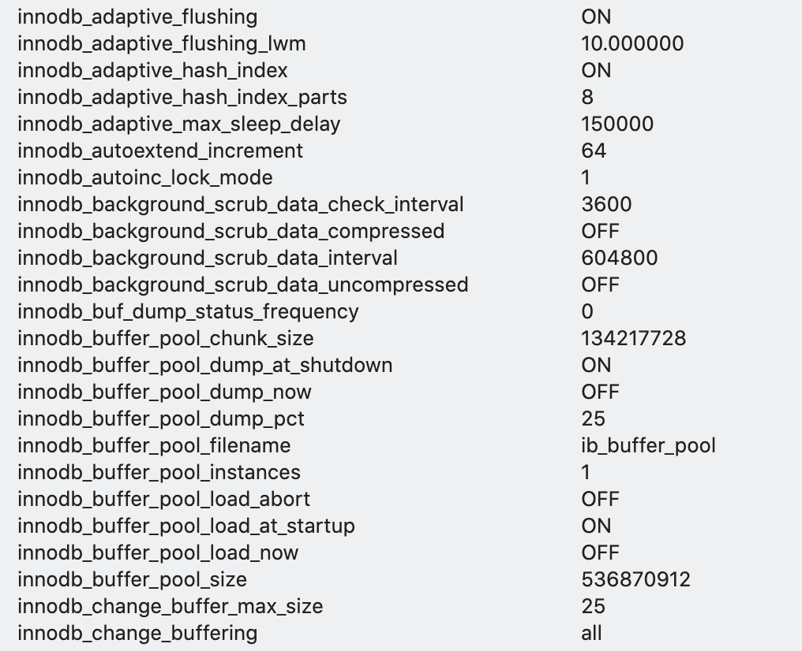
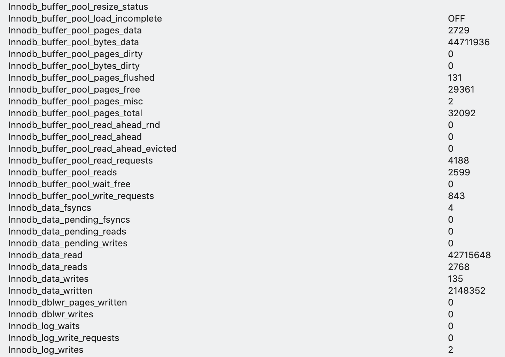
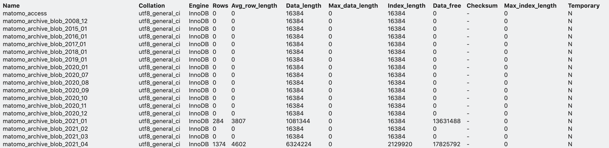
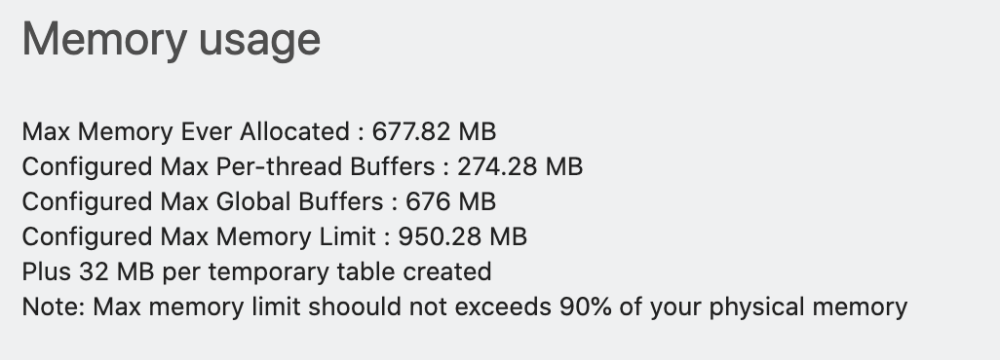
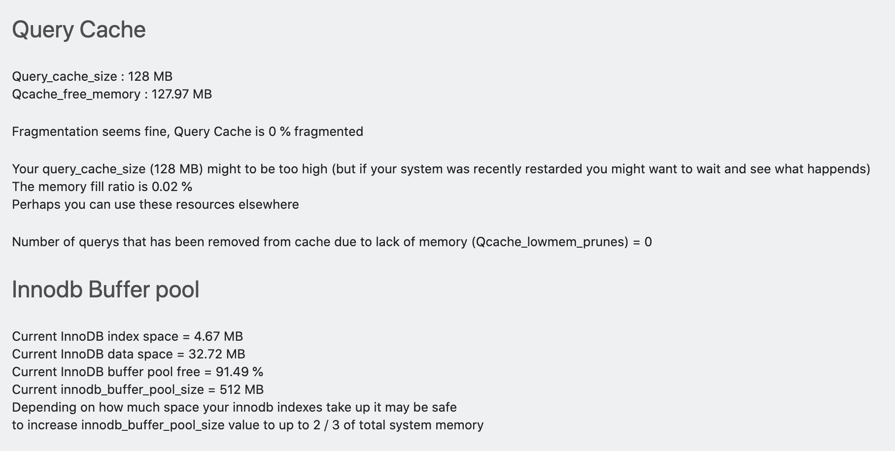

# Matomo DBHealth Plugin

## Description

This plugin simply gives you a sub menu in the admin section called 

## We have 4 menu items / features:
* DB Status variables 

  Than runs "SHOW STATUS" in MySQL

  The output will look something like this:

  

- DB Setting variables 

  Than runs "SHOW VARIABLES" in MySQL

  

- Show database table status 

  Than runs "SHOW TABLE STATUS" in MySQL

  This will give you detailed info about all your tables in the Matomo DB

  

  Run performance calculations

  This will run a few functions that will give you some insights about your Database and PHP settings with potential performance insights. Much of the code is inspired by tuning-primer.sh Writen by: Matthew Montgomery https://bugs.launchpad.net/mysql-tuning-primer

  

  